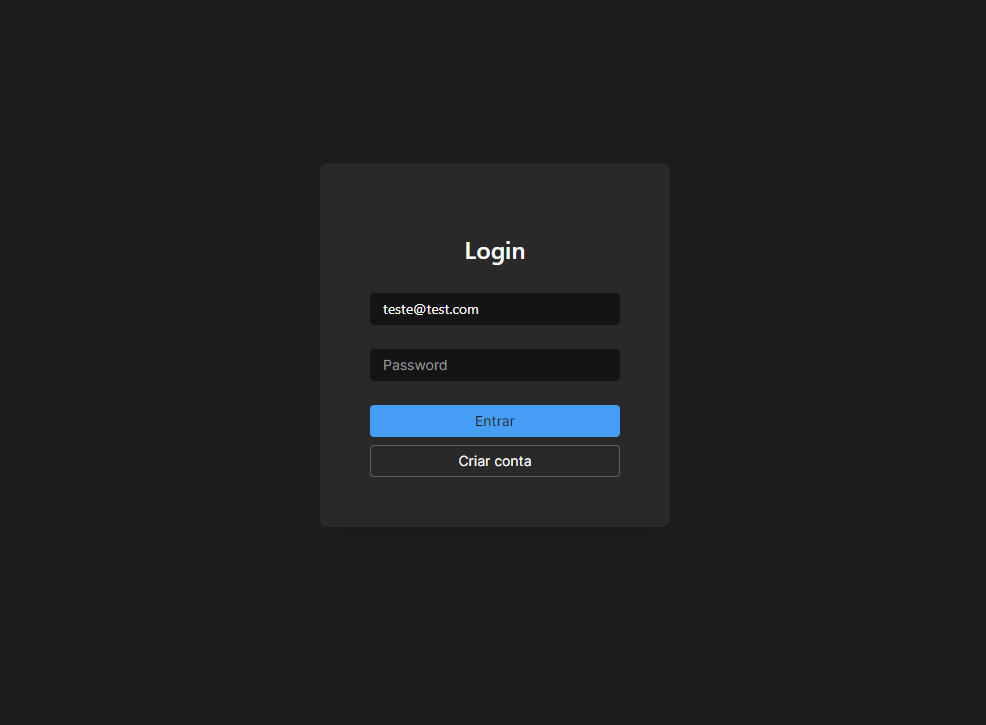

# Bem-vindo ao Front-End do VAGAS!

Desenvolvi este projeto com muito cuidado e dedicação, buscando criar uma interface o mais intuitiva possível. Ele é um reflexo do meu estilo de programação e, embora haja sempre espaço para melhorias, estou evoluindo a cada dia. Concluir um software com back-end e front-end em apenas 7 dias foi um grande desafio.

Aprendi muito durante esses 7 dias. O projeto ainda não está 100% finalizado, e peço desculpas por isso, pois 7 dias é realmente um prazo apertado.

Confesso que estou ansioso para saber o resultado. Independentemente do que acontecer, agradeço por esta oportunidade e espero que o sistema Pacto prospere, com ou sem a minha participação!
 
# Requisitos
Node - Versão: v20.12.2
Angular - Versão: 16.2.12 
O back-end tem que estar em execução, você pode acessar pelo github ou pelo arquivo anexo no email. 
[Visite o GitHub!](https://github.com/viMoraes10/vagas/tree/master)

